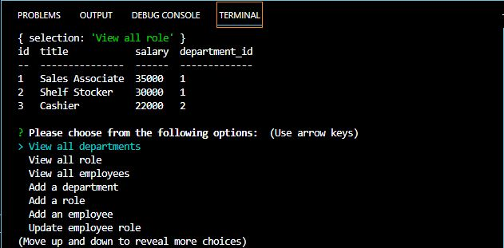

# Super-Cool-Employee-Tracker

## Description

In this project, I was required to create an app that manages employees through a local server in express. You can view and add departments, employees, and update their roles. All their information will be displayed within the terminal through console.table's dependency 

## Usage

This app requires the use of Node.js and MySQL in VSCode!

* First, clone the files into a directory.
* Then, run 'npm i' to install node.js and the dependencies.
* After that, make sure you edit the '.env' file to contain the correct username and password for MySQL.
* Finally, run 'npm start' and start tracking your employees.

## Screenshot

## Video Demo

Here is a link to my video demo!

https://drive.google.com/file/d/1IzgBAl_GpcnODpdxzQjcNP2jfx_zVUZY/view

